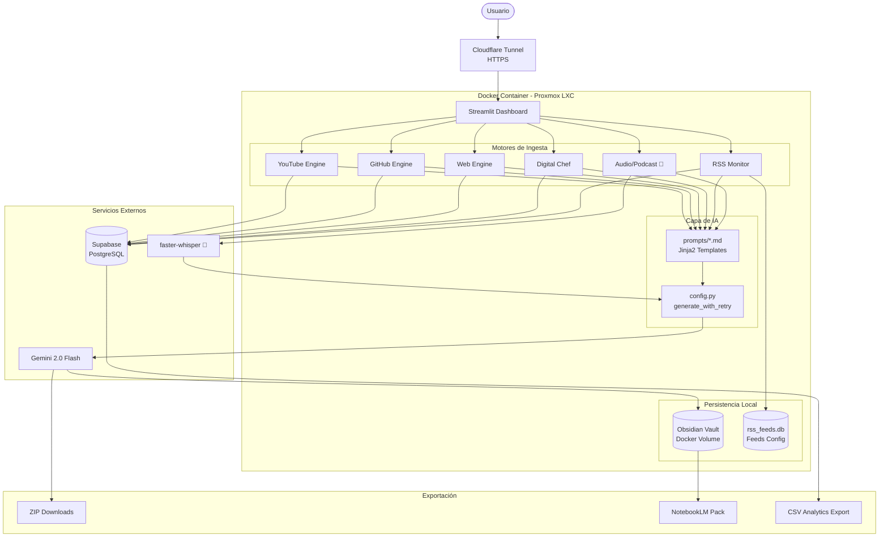

# System Architecture: Deep Audit Knowledge Engine

## 1. Visión General

El **Deep Audit Knowledge Engine** es un centro de operaciones de IA diseñado para la ingesta, análisis y archivo de conocimiento técnico de alta densidad. Transforma fuentes no estructuradas (video, código, blogs, podcasts, RSS) en activos de conocimiento atómicos para Obsidian y packs de fuentes para NotebookLM.

---

## 2. Diagrama del Sistema (Estado Actual)



> 🔲 = Planeado (Sprint futuro)

---

## 3. Estructura de Archivos

```text
/
├── app.py                    # Dashboard principal — UI y orquestación (8 tabs)
├── config.py                 # Gemini singleton + generate_with_retry() con tenacity
│
├── core/                     # Módulos de infraestructura
│   ├── __init__.py
│   ├── db.py                 # Persistencia central — knowledge.db (dedup + analytics)
│   └── prompt_loader.py      # Renderizador de prompts Jinja2
│
├── prompts/                  # Templates de prompts editables
│   ├── _base_system.md       # Sistema base compartido (Zettelkasten persona)
│   ├── youtube_analysis.md   # Prompt YouTube
│   ├── github_wiki.md        # Prompt GitHub Wiki
│   ├── web_curation.md       # Prompt Web
│   ├── rss_digest.md         # Prompt RSS
│   └── cooking_recipe.md     # Prompt Digital Chef
│
├── youtube_analyzer.py       # Motor YouTube (yt-dlp + transcript API)
├── github_analyzer.py        # Motor GitHub (Trees API + Contents API)
├── web_analyzer.py           # Motor Web (requests + BeautifulSoup4)
├── cooking_analyzer.py       # Motor Digital Chef (recetas + lista del súper)
├── knowledge_sync.py         # Puente con agentes externos (AuctionBot, DexScreener)
│
├── rss_db.py                 # SQLite CRUD para feeds y artículos vistos
├── rss_manager.py            # Orquestador de revisión de feeds RSS
├── notebooklm_pack.py        # Generador de Source Pack para NotebookLM
│
├── .env                      # API keys — NO en git
├── .env.example              # Plantilla de configuración
├── .gitignore
├── requirements.txt
├── requirements-dev.txt      # Dependencias de testing (pytest, playwright)
├── LICENSE                   # MIT
├── test_app_ui.py            # Tests E2E con Playwright
│
├── Dockerfile                # Contenedor Python + ffmpeg + Streamlit
├── docker-compose.yml        # App + Cloudflare Tunnel sidecar
├── setup_proxmox.sh          # [DEPRECADO] Despliegue systemd directo
├── youtube_service.service   # [DEPRECADO] Configuración Systemd
└── docs/
    ├── ARCHITECTURE.md       # Este archivo
    ├── BACKLOG.md            # Sprints y tareas
    ├── ROADMAP.md            # Visión y fases
    ├── FLOWS.md              # Diagramas de flujo de datos
    ├── ADR.md                # Architecture Decision Records
    ├── DATABASE_SCHEMA.md    # Esquemas SQLite
    └── HANDOFF.md            # Resumen ejecutivo para onboarding
```

---

## 4. Capas del Sistema

### Capa de Configuración (`config.py`)
Punto de entrada único para toda la IA. Carga variables de entorno con `python-dotenv`, inicializa el modelo Gemini una sola vez, y expone `generate_with_retry(prompt)` — función decorada con `tenacity` que maneja reintentos exponenciales ante errores de cuota (ResourceExhausted). Todos los módulos de análisis importan desde aquí; ninguno configura Gemini por su cuenta.

### Capa de Prompts (`core/prompt_loader.py` + `prompts/`)
Los prompts están externalizados como archivos Markdown con variables Jinja2 (`{{ title }}`, `{{ content }}`, etc.). El `prompt_loader` renderiza los templates y los inyecta al pipeline de IA. Esto permite iterar la calidad del output sin tocar código Python. Cada template puede incluir `_base_system.md` para compartir la persona base.

### Capa de Ingesta (Engines)
Cada engine es un módulo Python puro sin dependencia de Streamlit. Sigue la convención `{fuente}_analyzer.py` o `{fuente}_manager.py`:

- **YouTube Engine**: `yt-dlp` para metadatos + `youtube-transcript-api` para transcripciones. Caché en `st.session_state.transcript_cache` para no re-descargar en la misma sesión.
- **GitHub Engine**: Trees API recursiva para mapear repos sin clonarlos. Filtro de "archivos ADN" (README, package.json, docker-compose, etc.). Máximo 12 archivos críticos por repo.
- **Web Engine**: `requests` + `BeautifulSoup4` con eliminación de scripts/estilos. Límite de 15,000 caracteres al prompt.
- **Digital Chef**: Especialización del pipeline de YouTube para recetas. Genera lista consolidada del súper sobre múltiples recetas.
- **RSS Monitor**: `feedparser` + SQLite (`rss_feeds.db`). Detecta artículos nuevos comparando contra artículos vistos. Enruta al Web Engine.
- **Audio/Podcast** 🔲: Planeado para Sprint futuro.

### Capa de IA (Gemini 2.0 Flash)
Recibe prompts renderizados desde los templates Jinja2 con instrucciones de formato YAML + secciones requeridas. Siempre devuelve Markdown con frontmatter YAML válido para Obsidian. El modelo se elige por velocidad y ventana de contexto larga (necesaria para transcripciones y código).

### Capa de Persistencia
- **Supabase** (Central): Base de datos PostgreSQL que registra cada ingesta (URL, tipo, título, status, vault_path, timestamp). Habilita deduplicación global, analytics, y consultas cross-proyecto (n8n, otros bots). Reemplaza `knowledge.db` (ver ADR-012).
- **`rss_feeds.db`**: SQLite local para feeds RSS y artículos vistos. Permanece local porque es configuración, no data operativa.
- **Obsidian Vault**: Escritura directa en sistema de archivos (Docker volume). Ruta configurable via sidebar. Sanitización de nombres de archivo.
- **SQLite externo**: Agentes externos (AuctionBot, DexScreener) tienen sus propias DBs que Knowledge Sync lee en modo lectura.

### Capa de Infraestructura
- **Docker**: Contenedor `python:3.11-slim` con `ffmpeg` y dependencias. Reproducible y aislado.
- **Cloudflare Tunnel**: Sidecar `cloudflared` que expone el puerto 8501 como HTTPS público sin port forwarding ni configuración de firewall.
- **Docker Compose**: Orquesta ambos servicios con volumes para `rss_feeds.db` y vault.

### Capa de Exportación
- **ZIP Downloads**: Todos los tabs generan un ZIP descargable con las notas en `.md`.
- **NotebookLM Pack**: Recolecta URLs de todas las fuentes procesadas y genera: (1) `.txt` de URLs para importar, (2) nota `.md` de contexto maestro.
- **CSV Analytics**: Exporta el historial completo de ingestas desde el tab Analytics.

---

## 5. Estándar de Metadatos YAML

Todas las notas generadas siguen este esquema de frontmatter:

| Campo | Valores posibles |
|-------|-----------------| 
| `tipo` | `video_research`, `repo_audit`, `web_research`, `rss_research`, `receta`, `reporte_agentes`, `notebooklm_source_pack` |
| `fuente` | URL original |
| `fecha_ingesta` | ISO 8601 |
| `estado` | `procesado`, `auditado` |
| `canal` / `repo` / `agente` / `feed` | Metadato específico del tipo |

---

## 6. Patrones de Diseño Aplicados

- **Singleton**: El modelo Gemini se inicializa una vez en `config.py`.
- **Retry con backoff exponencial**: `tenacity` en `config.generate_with_retry()` reemplaza los bucles manuales que había en cada módulo.
- **Template Method**: Los prompts están externalizados como templates Jinja2 — los analyzers solo aportan variables, no la estructura del prompt.
- **Deduplicación global**: `core/db.has_been_processed(url)` consulta `knowledge.db` antes de cada ingesta.
- **Separación de UI y lógica**: Ningún módulo `_analyzer.py` importa `streamlit`. Toda la UI vive en `app.py`.
