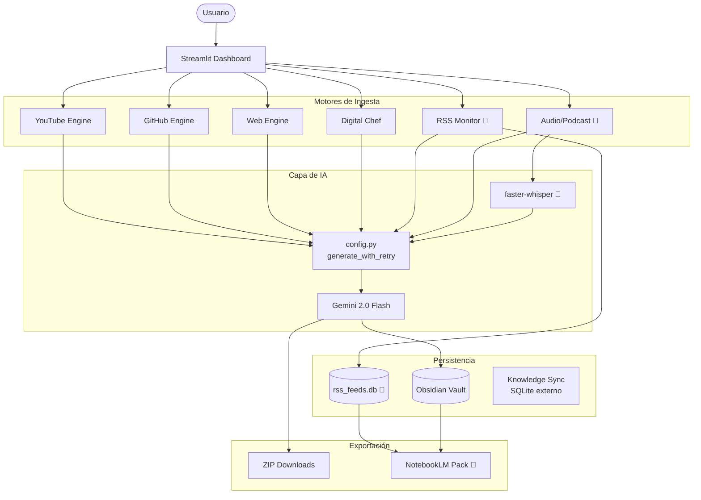

# System Architecture: Deep Audit Knowledge Engine

## 1. Visión General

El **Deep Audit Knowledge Engine** es un centro de operaciones de IA diseñado para la ingesta, análisis y archivo de conocimiento técnico de alta densidad. Transforma fuentes no estructuradas (video, código, blogs, podcasts, RSS) en activos de conocimiento atómicos para Obsidian y packs de fuentes para NotebookLM.

---

## 2. Diagrama del Sistema (Estado Actual)



> 🔲 = Planeado (Sprint 4-6)

---

## 3. Estructura de Archivos

```text
/
├── app.py                    # Dashboard principal — UI y orquestación
├── config.py                 # Gemini singleton + generate_with_retry() con tenacity
├── youtube_analyzer.py       # Motor YouTube (yt-dlp + transcript API)
├── github_analyzer.py        # Motor GitHub (Trees API + Contents API)
├── web_analyzer.py           # Motor Web (requests + BeautifulSoup4)
├── cooking_analyzer.py       # Motor Digital Chef (recetas + lista del súper)
├── knowledge_sync.py         # Puente con agentes externos (AuctionBot, DexScreener)
│
├── rss_db.py                 # 🔲 SQLite CRUD para feeds y artículos vistos
├── rss_manager.py            # 🔲 Orquestador de revisión de feeds RSS
├── notebooklm_pack.py        # 🔲 Generador de Source Pack para NotebookLM
├── audio_transcriber.py      # 🔲 Transcripción local con faster-whisper (singleton)
├── podcast_analyzer.py       # 🔲 Ingesta de audio/podcast (archivo o URL RSS)
│
├── .env                      # API keys — NO en git
├── .gitignore
├── requirements.txt
├── test_app_ui.py            # Tests E2E con Playwright
│
├── setup_proxmox.sh          # Despliegue como servicio systemd en LXC
├── youtube_service.service   # Configuración Systemd
└── docs/
    ├── ARCHITECTURE.md       # Este archivo
    ├── BACKLOG.md            # Sprints y tareas
    ├── ROADMAP.md            # Visión y fases
    ├── FLOWS.md              # Diagramas de flujo de datos
    ├── ADR.md                # Architecture Decision Records
    ├── DATABASE_SCHEMA.md    # Esquemas SQLite y Supabase
    └── HANDOFF.md            # Resumen ejecutivo para onboarding
```

---

## 4. Capas del Sistema

### Capa de Configuración (`config.py`)
Punto de entrada único para toda la IA. Carga variables de entorno con `python-dotenv`, inicializa el modelo Gemini una sola vez, y expone `generate_with_retry(prompt)` — función decorada con `tenacity` que maneja reintentos exponenciales ante errores de cuota (ResourceExhausted). Todos los módulos de análisis importan desde aquí; ninguno configura Gemini por su cuenta.

### Capa de Ingesta (Engines)
Cada engine es un módulo Python puro sin dependencia de Streamlit. Sigue la convención `{fuente}_analyzer.py` o `{fuente}_manager.py`:

- **YouTube Engine**: `yt-dlp` para metadatos + `youtube-transcript-api` para transcripciones. Caché en `st.session_state.transcript_cache` para no re-descargar en la misma sesión.
- **GitHub Engine**: Trees API recursiva para mapear repos sin clonarlos. Filtro de "archivos ADN" (README, package.json, docker-compose, etc.). Máximo 12 archivos críticos por repo.
- **Web Engine**: `requests` + `BeautifulSoup4` con eliminación de scripts/estilos. Límite de 15,000 caracteres al prompt.
- **Digital Chef**: Especialización del pipeline de YouTube para recetas. Genera lista consolidada del súper sobre múltiples recetas.
- **RSS Monitor** 🔲: `feedparser` + SQLite. Detecta artículos nuevos comparando contra `seen_articles`. Enruta al Web Engine.
- **Audio/Podcast** 🔲: `faster-whisper` (modelo local) para transcripción. Soporta archivo subido o URL de feed RSS de podcast. Reutiliza `analyze_video_content()` del YouTube Engine.

### Capa de IA (Gemini 2.0 Flash)
Recibe prompts estructurados con instrucciones de formato YAML + secciones requeridas. Siempre devuelve Markdown con frontmatter YAML válido para Obsidian. El modelo se elige por velocidad y ventana de contexto larga (necesaria para transcripciones y código).

### Capa de Persistencia
- **Obsidian Vault**: Escritura directa en sistema de archivos. Ruta configurable via sidebar. Sanitización de nombres de archivo.
- **SQLite local** 🔲: `rss_feeds.db` para feeds y artículos vistos (RSS Monitor).
- **SQLite externo**: Agentes externos (AuctionBot, DexScreener) tienen sus propias DBs que Knowledge Sync lee en modo lectura.

### Capa de Exportación
- **ZIP Downloads**: Todos los tabs generan un ZIP descargable con las notas en `.md`.
- **NotebookLM Pack** 🔲: Recolecta URLs de todas las fuentes procesadas (sesión + historial RSS) y genera: (1) `.txt` de URLs para importar a NotebookLM, (2) nota `.md` de contexto enriquecida por Gemini.

---

## 5. Estándar de Metadatos YAML

Todas las notas generadas siguen este esquema de frontmatter:

| Campo | Valores posibles |
|-------|-----------------|
| `tipo` | `video_research`, `repo_audit`, `web_research`, `receta`, `reporte_agentes`, `reporte_agente`, `podcast_research` 🔲 |
| `fuente` | URL original |
| `fecha_ingesta` | ISO 8601 |
| `estado` | `procesado` |
| `canal` / `repo` / `agente` | Metadato específico del tipo |

---

## 6. Patrones de Diseño Aplicados

- **Singleton**: El modelo Gemini se inicializa una vez en `config.py`. El modelo faster-whisper 🔲 se inicializa una vez en `audio_transcriber.py`.
- **Retry con backoff exponencial**: `tenacity` en `config.generate_with_retry()` reemplaza los bucles manuales que había en cada módulo.
- **Inversión de dependencia**: `rss_manager.py` 🔲 recibe `save_note` como parámetro en lugar de importar Streamlit directamente.
- **Separación de UI y lógica**: Ningún módulo `_analyzer.py` importa `streamlit`. Toda la UI vive en `app.py`.
