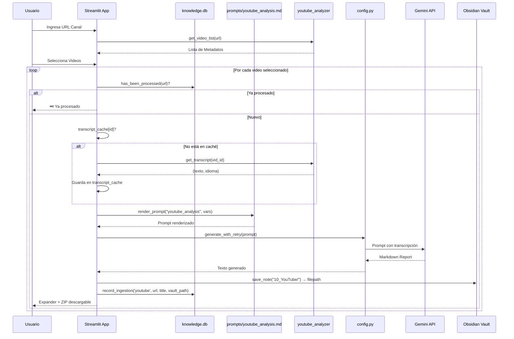
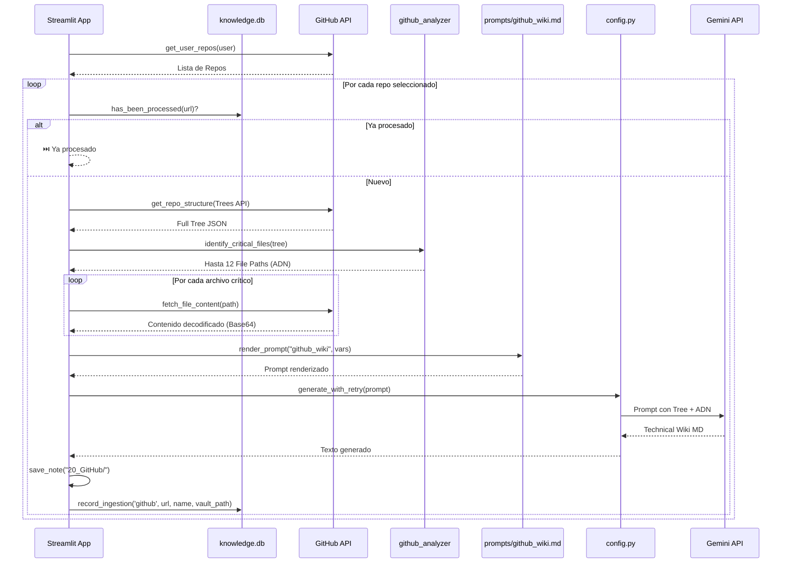
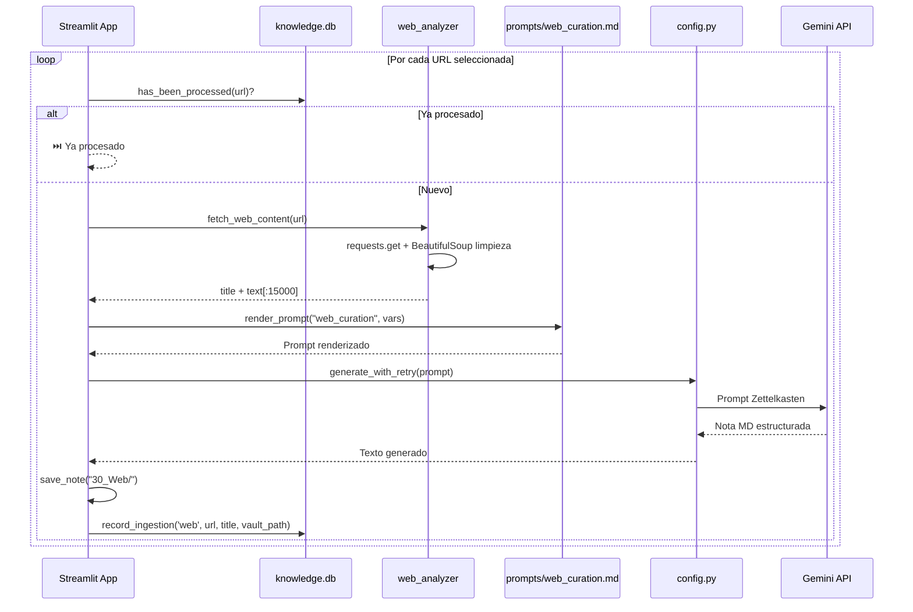
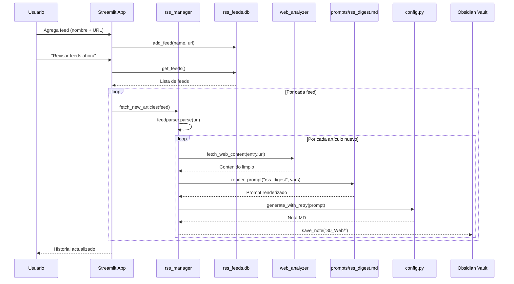
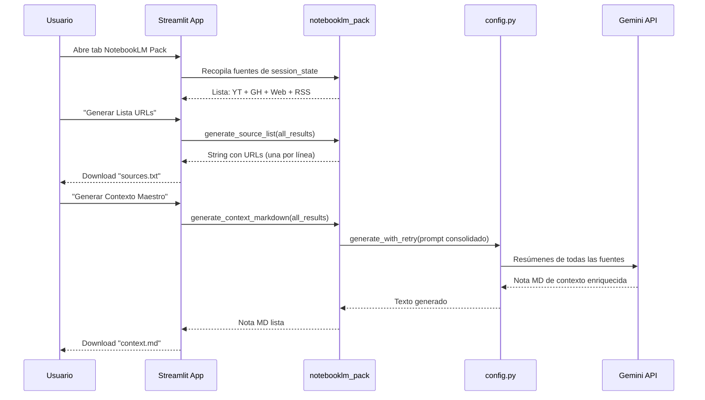
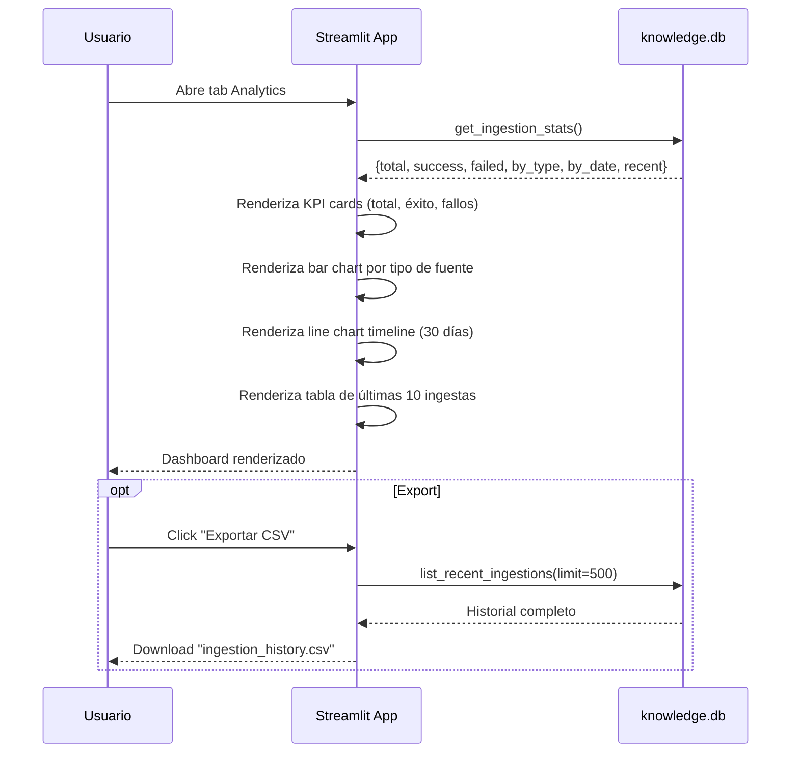
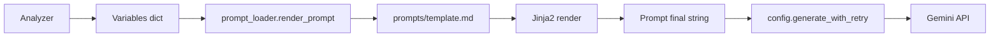
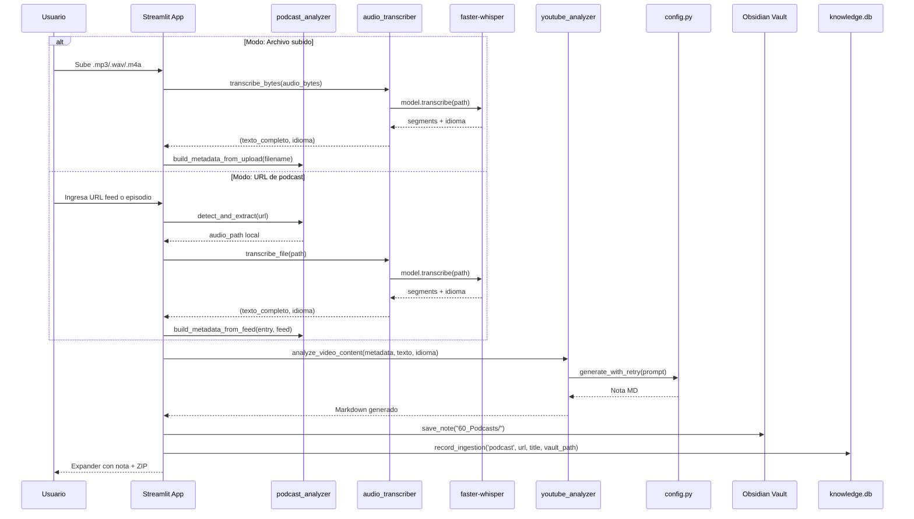

# Data Flows: Deep Audit Knowledge Engine

## 1. Flujo de Auditoría YouTube

---

## 2. Flujo de Auditoría GitHub

---

## 3. Flujo de Ingesta Web

---

## 4. Flujo RSS Monitor

---

## 5. Flujo NotebookLM Source Pack

---

## 6. Flujo Analytics Dashboard

---

## 7. Flujo de Prompt Rendering

---

## 8. Flujo Audio/Podcast (Sprint 6 — Planeado)

