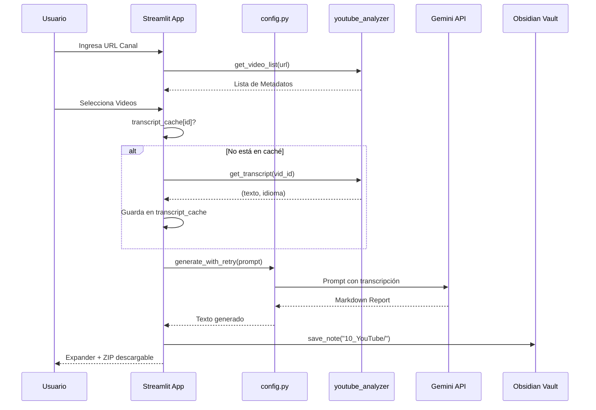
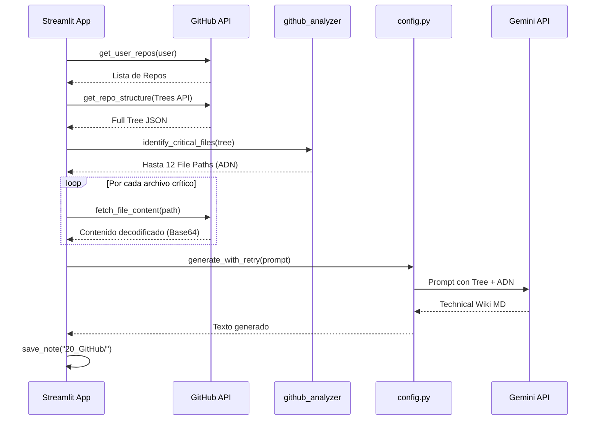
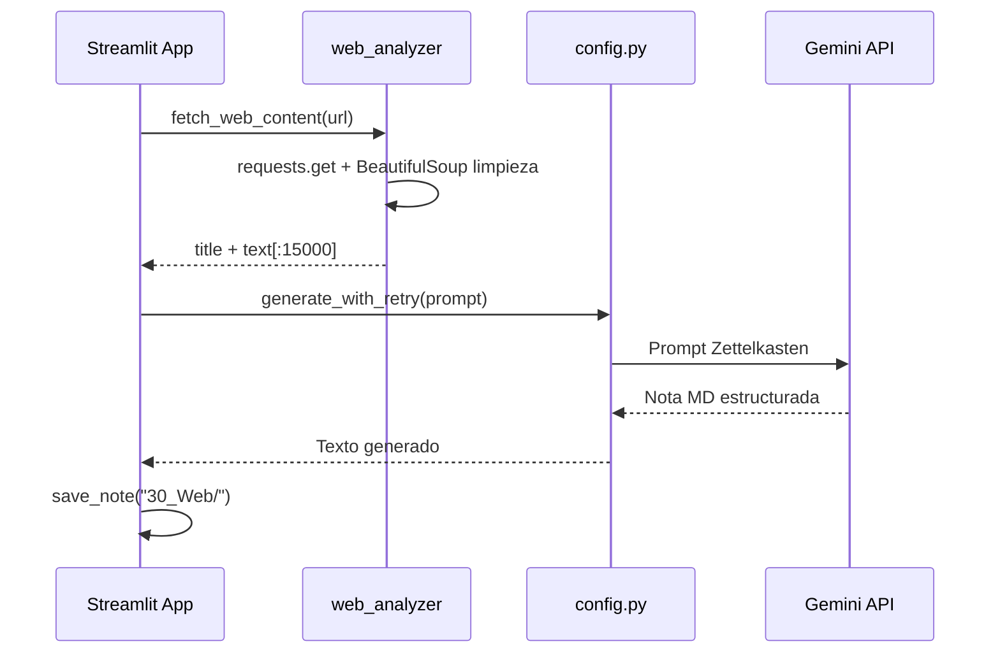
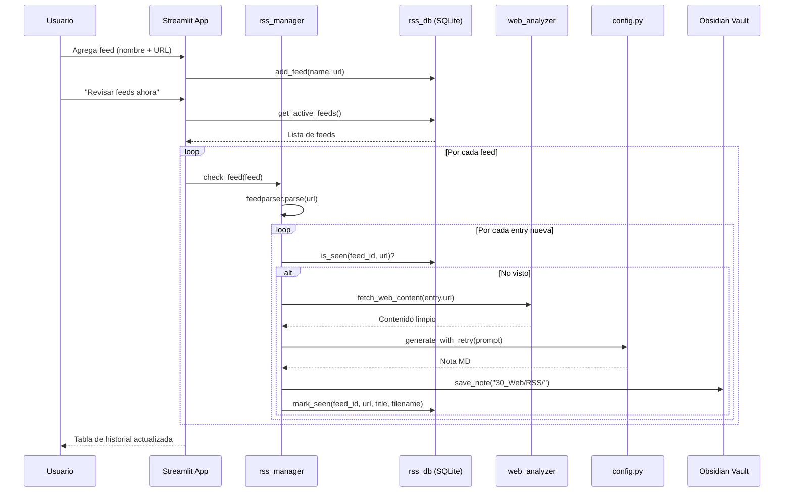
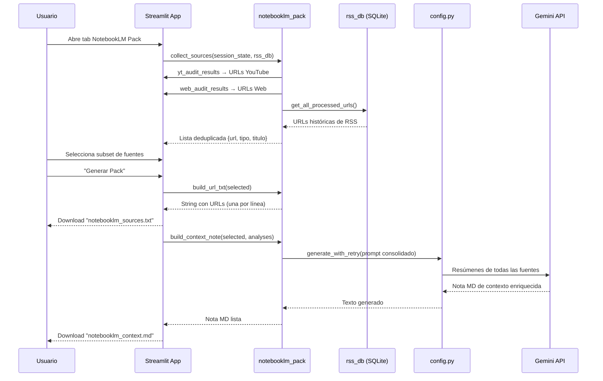
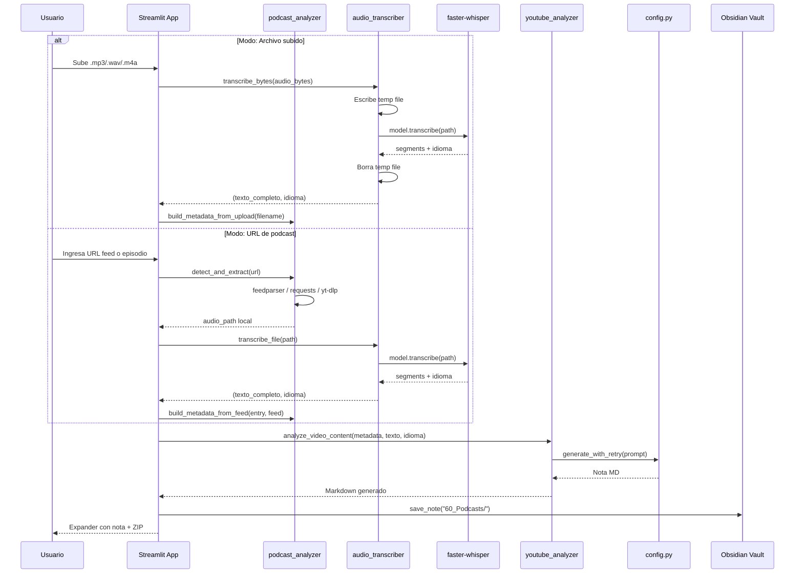

# Data Flows: Deep Audit Knowledge Engine

## 1. Flujo de Auditoría YouTube

---

## 2. Flujo de Auditoría GitHub

---

## 3. Flujo de Ingesta Web

---

## 4. Flujo RSS Monitor (Sprint 4 — Planeado)

---

## 5. Flujo NotebookLM Source Pack (Sprint 5 — Planeado)

---

## 6. Flujo Audio/Podcast (Sprint 6 — Planeado)

